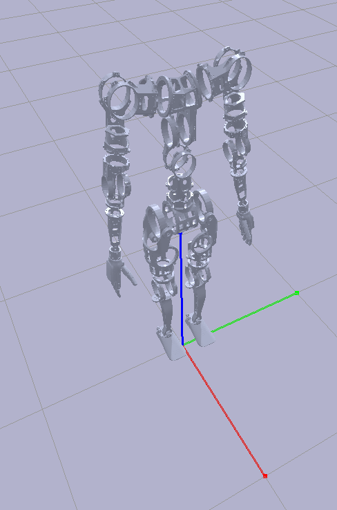
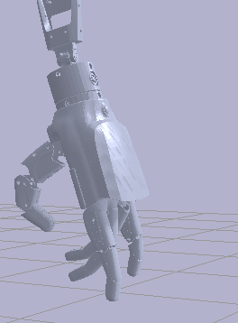
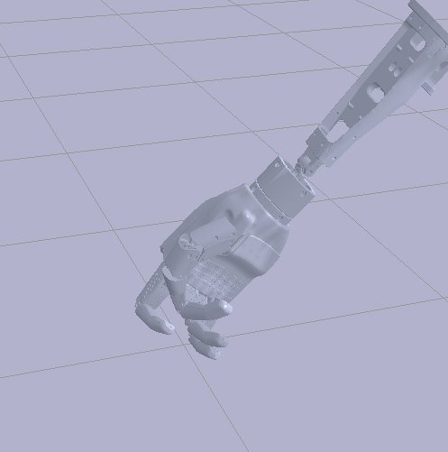

# MIPA V3.1 URDF Model

**CONFIDENTIAL - PROPRIETARY INFORMATION**  
This URDF model and all associated files are confidential and proprietary to Neura Robotics.

## Overview
This folder contains the URDF (Unified Robot Description Format) model for 4NE-1 Gamma Rev B. This is a development version and subject to significant changes.

## ⚠️ Important Notice
This is a preliminary version of the URDF model. The following aspects are subject to change:
- Joint names
- Joint order
- Joint limits
- Joint axis orientations
- Kinematic properties
- Inertia properties
- Maximum joint efforts
- Number of degrees of freedom (7 DOF arms, 3 DOF torso, 6 DOF legs). 2 will be added for the head.
- Approximate sensor locations

## Known Issues
1. Joint properties are incomplete:
   - Maximum efforts not set
   - Maximum velocities not set

2. Model limitations:
   - Hands are not actuated
   - No textures included
   - Collision meshes are at full resolution (not optimized)

## Setup Instructions
To visualize the URDF model, follow these steps:

1. Create and activate a Python virtual environment:
```bash
python -m venv venv
source venv/bin/activate  # On Windows: venv\Scripts\activate
```

2. Install required packages:
```bash
pip install -r requirements.txt
```

3. Run the visualization script:
```bash
python show_humanoid_ich.py
```

The result looks like this





## Reporting Issues
For any errors, inconsistencies, or change requests, please contact:  
Tobias Jacob (tobias.jacob@neura-robotics.com)

## License
All rights reserved. This model is the property of Neura Robotics and may not be used, reproduced, or distributed without explicit written permission.

---
© 2024 Neura Robotics. All rights reserved.
